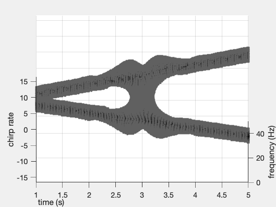
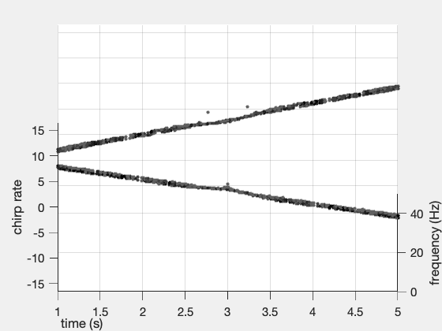

# Synchrosqueezed-chirplet-transforms
MATLAB code for the implementation of the Synchrosqueezed chirplet transforms with some examples.

File explanation:

dwindow.m -- compute the derivative of a given window

sqSTFT.m -- STFT-based Synchrosqueezed transforms (SST)

sqSTCT.m -- STFT-based Synchrosqueezed chirplet transforms (SCT, including chirplet transforms)

sqSTFTbase2nd.m -- STFT-based second order SST

SSTinverse.m -- inverse map of SCT

example1.m -- example of standard linear chirps

example2.m -- example of a signal with time-varying chirp rate

example3.m -- example of wolf howling signal

